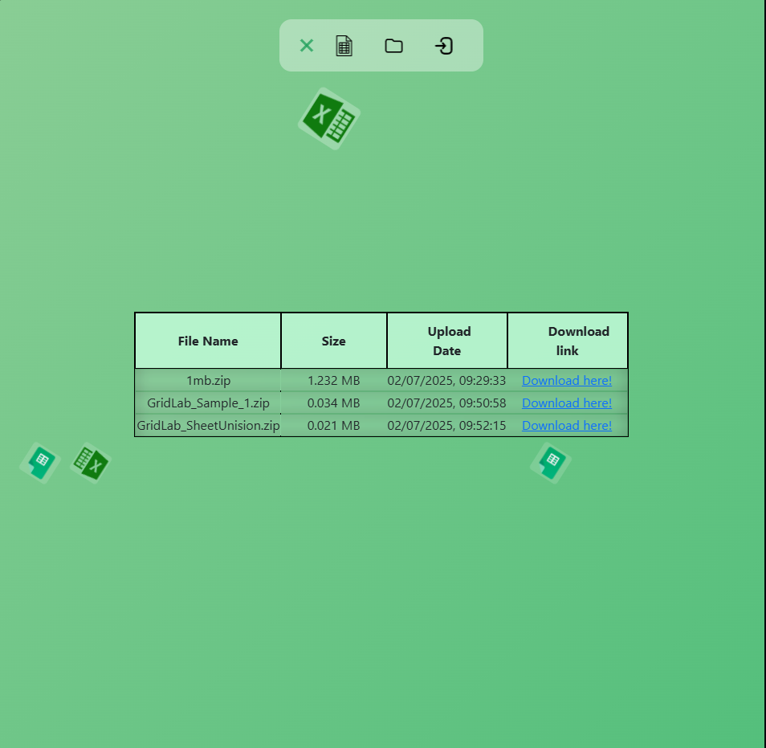

<h1 align="center">  <strong>Grid Lab​<strong> </h1>


------

## Sobre o Projeto

Bem-vindo!

Frustrado com a falta de ferramentas para mesclar e dividir planilhas corretamente para o meu trabalho, eu criei minha própria solução: **GridLab**!

Este é o GridLab, um aplicativo FullStack divertido e útil, que utiliza **Java Spring, Angular e PostgreSQL** como tecnologias principais para construir a API que atenderá às suas necessidades ao gerenciar seu Excel ou Planilhas Google! Role para baixo para ver mais detalhes!

## 

### Construído com

* Front-end
  
  * HTML / SCSS & Boostrap / TS
  * Angular 19 
  * Angular Material

* Back-end
  
  * Java Spring Boot
  * Spring Security (JWT + Refresh Tokens + HTTPOnly Cookie)
  * Apache POI
  * MultiPartFile API
  * PostgreSQL Database
  * Maven
  * Lombok
  * MVC design pattern
  
  #### 

### Design Pattern

#### Backend

```
src/main/java/com/kaiqueapol/gridlab
├── controllers           # REST controllers (API endpoints)
├── dto                   # Objetos de transferência de dados
├── entities              # Entidades JPA
├── infra
│   ├── exceptions        # Controle de excessões customizadas
│   ├── security          # Configuração Spring Security (JWT, filters, etc.)
├── repositories          # Repositórios JPA
├── services              # Camada de lógica de negócios
├── util                  # Classes de utilidades
├── validations           # Classes de validações para não sobrecarregar outras classes
```

#### Frontend

```
src/app
├── components            # Componentes do App
├── entities              # Entidade do app
├── guard                 # Route guard (AuthGuard)
├── interceptors          # Interceptores HTTP para requisitos 
├── services              # Acesso ao backend
```

### Documentação Swagger

Para acessar a documentação do Grid Lab no Swagger, acesse:

```
localhost:8080/gridlab-swagger
```

## Como usar

#### Back-end *(port 8080)*

```
# Clone o repositório
git clone https://github.com/Kaique-Apolinario/GridLab.git

# Entre no diretório pela sua IDE
cd ./Back-end

# Execute
./mvnw spring-boot:run
```

#### Front-end *(port 4200)*

```
# Clone o repositório
git clone https://github.com/Kaique-Apolinario/GridLab.git

# Entre no diretório pela sua IDE
cd ./Front-end/GridLab_Angular

# Instale as dependências
npm install

# Execute
ng serve --o
```

## Pré-requisitos

* Java 17+
* Maven
* Node.js
* IDE, como VS Code ou Eclipse/IntelliJ IDEA

## Recursos

### Divida planilhas grandes em partes menores


Você pode dividir suas planilhas carregando a planilha grande e digitando em quantas partes você deseja que ela seja dividida. Baixe-a logo em seguida!

#### Preserve o cabeçalho

* Ao habilitar "Preservar o cabeçalho", cada nova planilha terá a mesma primeira linha. Isso é útil nos casos em que você deseja que todas tenham o mesmo cabeçalho.

### Mescle várias planilhas em uma


Você pode mesclar várias planilhas em uma, enviando-as e depois baixando-as.

#### Ignore linhas repetidas

* Ao habilitar "Ignorar linhas repetidas", você garante que cada linha na planilha final seja única.

#### Ordenando arquivos

* Após enviar todas as planilhas a serem mescladas, você poderá alterar a ordem em que cada planilha será copiada para a planilha final.

## Responsividade


## Spring Security

- Tratamento seguro de **expiração e renovação de JWT**

- Compreensão e implementação completas dos **fluxos de tokens de atualização**, rotacionados na atualização, e dos antigos invalidados no banco de dados.


## Endpoints

##### Endpoints do usuário

* `/login`: usado para efetuar login do usuário para que ele possa usar o GridLab.
  
  input:
  
  * ```json
    {
        "email":"kaique@gridlab.com",
        "password": "kaiquegridlab"
    }
    ```
  
  output:
  
  * ```json
    {
        "acessToken": "jwt_code_here",
        "userId": 1
    }
    "refreshToken" é enviado como um cookie HttpOnly para o frontend para maior segurança..
    ```

* `/register`: usado para cadastrar um novo usuário.
  
  input:
  
  * ```json
    {
        "email": "kaique@teste.com",
        "password": "kaiqueteste",
        "confirmationPassword": "kaiqueteste"
    }
    ```

* `/refreshToken`: usado para substituir o accessToken de curta duração expirado usando um refreshToken de longa duração (enviado como um cookie), permitindo o uso prolongado do GridLab sem precisar fazer login novamente. Os usuários só precisá relogar quando o refreshToken expirar.

* `/logout`: usado para excluir o refreshToken do localStorage e invalidá-lo no banco de dados.
  
  ##### Endpoints de manipulação de arquivos

* `/upload/merger/`: usado para fazer upload de planilhas .xslx ou .xls e combiná-las.
  
  

* `/upload/divider/`: usado para carregar planilhas .xslx ou .xls e dividi-las em partes determinadas.
  
  

* `/download/{fileId}`: usado para baixar um arquivo enviado

* `/fileLib/{id}`: usado para acessar os arquivos enviados pelo usuário. O usuário só pode acessar sua página de planilhas carregadas.
  
  
  

## Como contribuir

1. Faça um fork (https://github.com/Kaique-Apolinario/GridLab/fork)
2. Crie sua branch de funcionalidade (`git checkout -b feature/name`)
3. Faça commit das suas alterações (`git commit -am 'Add some changes'`)
4. Faça um push para a branch (`git push origin feature/name`)
5. Crie um novo **Pull Request**!

## Licença

[](https://github.com/Kaique-Apolinario/task-manager/blob/main/LICENSE) 

Código sob licença MIT.

## Autor and Contato

<table>
  <tbody>
    <tr>
      <td align="center" valign="top" width="15%">
          
          <br />
          <sub>
              <b>Kaique Apolinário 🙋‍♂️👨‍💻 </b>
          </sub>
          <br>
          <sub>
              
          </sub>
</td>
    </tr>
  </tbody>
  </table>
